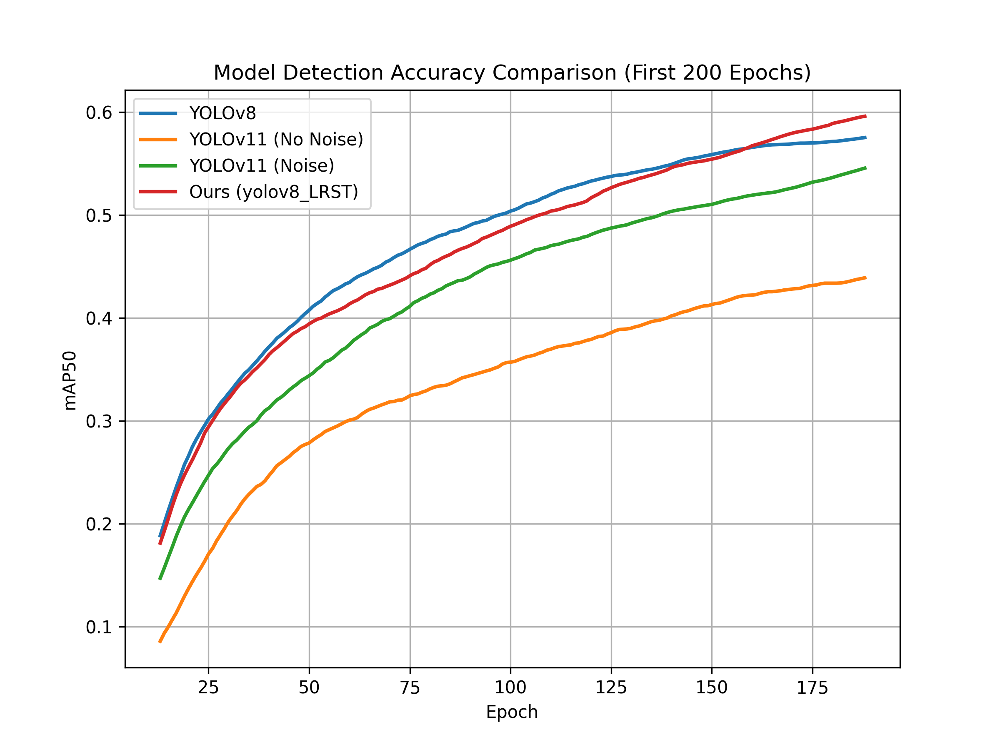

# 轨道交通信号标志的实时识别系统

<div align="center">
  
</div>

## 📌 项目亮点

- ✅ **mAP50 0.652** - 在参数量基本相同的情况下，识别精度超过yolov8和yolov11
- ⚡ **32 FPS** - 在Realsense D435i上的实时性能
- 🛠️ **三大创新** - LRSA注意力/AKConv/图像增强流水线
- 📱 **轻量化** - 模型仅8.8MB (FP16量化后)

[](https://www.python.org/)
[](https://pytorch.org/)
[](https://opensource.org/licenses/Apache-2.0)

## ⭐项目概述
本项目旨在设计一种轻量化的深度神经网络，用于在嵌入式设备上实时识别轨道交通信号标志。我们针对YOLO系列模型进行了优化，引入了局部区域自注意力机制（LRSA）和图像增强技术，以提高小目标和遮挡场景下的检测精度。最终模型部署在Realsense D435i上，实现了摄像头画面的实时检测。

## ⭐主要工作
在本研究中，我们不仅在嵌入式设备中进行了图像处理技术的创新，还通过改进YOLO模型的 backbone 部分和将其部署在实时检测设备上，进一步提升了轨道交通信号标志的自动识别能力。我们的工作可以分为三个关键部分：
### 1. 实时图像处理技术
#### (1) 图像增强
- 我们借鉴了CVPR2024年提出的 [Color Shift Estimation-and-Correction for Image Enhancement](https://github.com/yiyulics/CSEC) 这篇论文中的方法，通过校正过曝和欠曝区域的亮度、消除因增亮或变暗带来的细节丢失和颜色伪影，显著提升了图像细节和颜色的表现。
- 该方法结合UNet网络、伪正态特征生成器、颜色偏移估计（COSE）模块以及颜色调制（COMO）模块，有效解决了复杂环境下的视觉问题，为后续信号标志的识别提供了更准确的图像输入。
#### (2) 边缘强化
- 我们使用了一种基于Canny算子的图像边缘强化算法，用于提升图像中边缘的清晰度。
- 在低对比度或模糊的情况下（通常由行驶速度和天气因素影响），边缘强化有助于改善轨道交通信号标志检测精度.
#### (3) 色彩识别与增强
- 为提高交通信号的识别能力，特别是红绿灯信号的颜色准确识别，我们基于OpenCV实现了色彩识别和增强技术。
- 这一方法通过对图像中的特定颜色（如红绿灯的红、绿、黄）进行精确识别和增强，能够减少由于环境光照变化、物体遮挡或信号标志颜色偏差带来的误判问题，从而确保识别系统的高准确性和可靠性。

### 2. YOLO模型的改进
针对YOLO在小目标和遮挡检测中的不足，我们提出了对其backbone部分的改进。我们引入了局部区域自注意力机制（Local-Region Self-Attention, LRSA），并评估了该机制对YOLOv8n和YOLOv11n模型的影响，特别是在不同位置（如p3和p4）的加入对模型参数量和精度的影响。

#### (1) 模块设计
##### 重叠补丁
模仿HPINet的方法，LRSA采用重叠补丁方式增强特征交互。这一设计突破了传统局部区域划分的限制，允许不同局部区域之间的信息重叠，从而帮助模型捕捉跨越局部边界的特征关系，避免因局部区域划分而丢失关键细节。
##### 投影
输入的特征数据与共享的权重矩阵进行运算，保证在不同局部区域能够一致地提取和处理特征，从而提高了模型的通用性和效率。
##### 多头自注意力（MSA）
通过多头自注意力机制，模型能够从多个角度计算注意力权重，并综合不同视角的信息，提升对局部细节的表达能力，从而增强对复杂场景中目标的检测精度。

#### (2) 性能提升
通过将LRSA与YOLO11C2PSA模块结合，我们强化了模型在小目标和复杂区域中的特征捕捉能力。LRSA的加入显著提升了YOLOv11模型在不同尺度目标的适应性，提高了模型对复杂场景的理解和抗干扰性。在实验中，LRSA加入p3位置时，相较于加入p4位置，mAP50提升了0.03，最终达到了FLOPS = 8.8和mAP50 = 0.652的最优性能。

### 3. 模型部署与实时检测
我们将改进后的YOLO模型部署在Realsense D435i摄像头上，实现了实时图像检测。借助Realsense的深度感知能力和高效的嵌入式处理技术，我们的模型能够在复杂的轨道交通环境中实时识别信号标志，并做出快速反应。


## ⭐模型性能

### 模型优化实验——性能对比 (FLOPS vs. mAP50)

| Model | FLOPS (G) | AP<sub>50</sub><sup>test</sup> | Notes |
| :-- | :-: | :-: | :-- |
| **v8_n** | 8.1 | 0.585 | 基线模型 |
| **v8_n_LRSA(p4)** | 8.8 | 0.622 | 在p4层加入LRSA注意力|
| **v8_n_LRSA(p3)** | 8.8 | **0.652** | **最优性能** |
| v8_n_LRSA_neg(p3) | - | - | 实验失败 |
| v8_n_AKConv | 7.6 | ~0 | AKConv不适用 |
| v8_prune | 7.3 | ~0 | 剪枝实验，不适用 |
| **v11_n 无噪声** | 6.3 | 0.457 | v11基线 |
| **v11_n 加噪** | 6.3 | 0.596 | 数据增强 |
| v11_n_neg | × | × | 实验失败 |
| **v11_n_LRSA(p4)** | 7.0 | 0.552 | 在p4层加入LRSA注意力 |
| **v11_n_LRSA(p3)** | 7.0 | 0.603 | 调整注意力位置 |
| **v11_n_LRSA+AKConv** | 6.9 | 0.540 | 混合架构 |
| **v11_s** | 21.3 | 0.647 | 大模型对比 |

### 关键结论

- **最佳模型**: v8_n_LRSA(p3)
  - FLOPS: 8.8 G
  - mAP50: **0.652**
  
- 性能趋势:
  - LRSA注意力有效提升精度（最高+6.7%）
  - AKConv在本任务中效果不佳
  - 引入正负样本进行对比学习效果不佳
  - v11系列模型更轻量但精度略低

    
### 性能对比 (OSDAR23测试集)

| Model | Test Size | AP<sup>test</sup> | AP<sub>50</sub><sup>test</sup> | batch 1 fps | batch 32 avg time |
| :---- | :-------: | :---------------: | :---------------------------: | :---------: | :--------------: |
| [**YOLOv8n**](https://github.com/ultralytics/ultralytics) | 640 | **28.6%** | **38.5%** | 556 *fps* | 1.8 *ms* |
| [**YOLOv11n**](https://github.com/ultralytics/ultralytics) | 640 | **34.7%** | **47.9%** | 400 *fps* | 2.5 *ms* |
| [**Ours**](#) | 640 | **41.9%** | **54.9%** | 417 *fps* | 2.4 *ms* |

## ⭐数据集

“Open Sensor Data for Rail 2023”（*[OSDaR23](https://data.fid-move.de/dataset/osdar23)*，DOI: 10.57806/9mv146r0）是由德国铁路交通研究中心（DZSF）、数字铁路德国 / DB Netz AG 和 FusionSystems GmbH 联合研究项目创建的。

该数据集包含45个标注的多传感器数据序列，在本任务中，我们仅使用RGB图片、红外图像以及标注的JSON文件来检测“signal”类别：

- RGB 图片（.png）：用于捕捉彩色图像。
- 红外图片（.png）：用于捕捉红外图像。
- JSON 文件：包含标注信息，记录每张图像中“signal”类别的物体类型和位置。

根据要求，我们在根目录的datasets文件夹中完成了训练集，测试集，和验证集的划分。

## ⭐运行环境

### 硬件环境
- GPU: RTX 4090D (24GB) * 2
- CPU: AMD EPYC 9754 128-Core Processor (18 vCPU)
- 内存: 60GB
- 存储: 系统盘30GB + 数据盘85GB

### 软件环境

- PyTorch==2.3.0
- Python==3.12
- CUDA==12.1

## ⭐运行步骤

<details open>
<summary>安装</summary>


  
首先将本仓库克隆到本地电脑上

```bash
git clone https://github.com/Frantzzzzz/signal-detection.git
```
使用pip命令安装`ultralytics`包

```bash
pip install ultralytics
```
然后根据 requirements.txt文件中需要的第三方库进行安装，或直接使用以下命令
```bash
pip install -r requirements.txt
```

</details>

<details open>
<summary>使用</summary>


#### 🌟 模型训练

在根目录下找到train_demo.py文件，运行下面这行代码，结果将会保存在 runs/detect/train 文件夹中

```python
import warnings
warnings.filterwarnings('ignore')
from ultralytics import YOLO
 
if __name__ == '__main__':
    # model = YOLO('ultralytics-main/ultralytics/cfg/models/11/yolo11-traffic-Akconv.yaml')   # yolov11+Akconv
    # model = YOLO('ultralytics-main/ultralytics/cfg/models/11/yolo11-traffic.yaml')   # yolov11(+LRST)
    model = YOLO('ultralytics-main/ultralytics/cfg/models/v8/yolov8.yaml')   # yolov8(+LRST)
    model.train(data='ultralytics-main/ultralytics/cfg/datasets/traffic.yaml',   # 指定训练数据集的配置文件路径，这个.yaml文件包含了数据集的路径和类别信息
                cache=True,  # 是否缓存数据集以加快后续训练速度，False表示不缓存
                epochs=400,   # 设置训练的总轮数为400轮
                batch=16,      # 设置每个训练批次的大小为16，即每次更新模型时使用16张图片
                close_mosaic=10,  # 设置在训练结束前多少轮关闭 Mosaic 数据增强，10 表示在训练的最后 10 轮中关闭 Mosaic
                workers=8,       # 设置用于数据加载的线程数为8，更多线程可以加快数据加载速度
                patience=50,     # 在训练时，如果经过50轮性能没有提升，则停止训练（早停机制）
                device=[0,1],      # 指定使用的设备，'0'表示使用第一块GPU进行训练
                optimizer='SGD', #设置优化器为SGD（随机梯度下降），用于模型参数更新
                # neg_dir="autodl-tmp/neg_dir",  # 负样本文件夹
                # neg_num=-2,  # 负样加入数
                verbose=True,
    )
```
*⚠️ 如果你想同时使用正负样本进行训练，请取消掉model.train中的注释*

#### 🌟 模型验证

在根目录下找到val.py文件，运行下面这行代码，结果将会保存在 runs/val 文件夹中

```python
from ultralytics import YOLO
import sys
sys.path.append('ultralytics-main/ultralytics/nn/modules/')

# 导入LRSA模块
try:
    from LRSA import LRSA
    print("LRSA module loaded successfully.")
except ImportError:
    print("LRSA module not found!")

if __name__ == '__main__':
    model = YOLO('runs/detect/train30/weights/best.pt') 
    model.val(data='ultralytics-main/ultralytics/cfg/datasets/traffic.yaml',
              split='test',
              batch=16,
              conf=0.1,      
              iou=0.5,       
              save_json=True, 
              project='runs/test',
              name='v8',
    )
```
#### 🌟 模型预测

在根目录下找到predict.py文件，运行下面这行代码，结果将会保存在 runs/detect/predict 文件夹中

```python
from ultralytics import YOLO
import sys
sys.path.append('ultralytics-main/ultralytics/nn/modules/')

# 导入LRSA模块
try:
    from LRSA import LRSA
    print("LRSA module loaded successfully.")
except ImportError:
    print("LRSA module not found!")

# Load pretrained model
model = YOLO("runs/detect/train30/weights/best.pt")  
imagepath = r'autodl-tmp/datasets/images/test'
model.predict(source=imagepath, save=True, imgsz=640, conf=0.5)
```


### ⭐测试结果

<div align="center">
  


</div>

